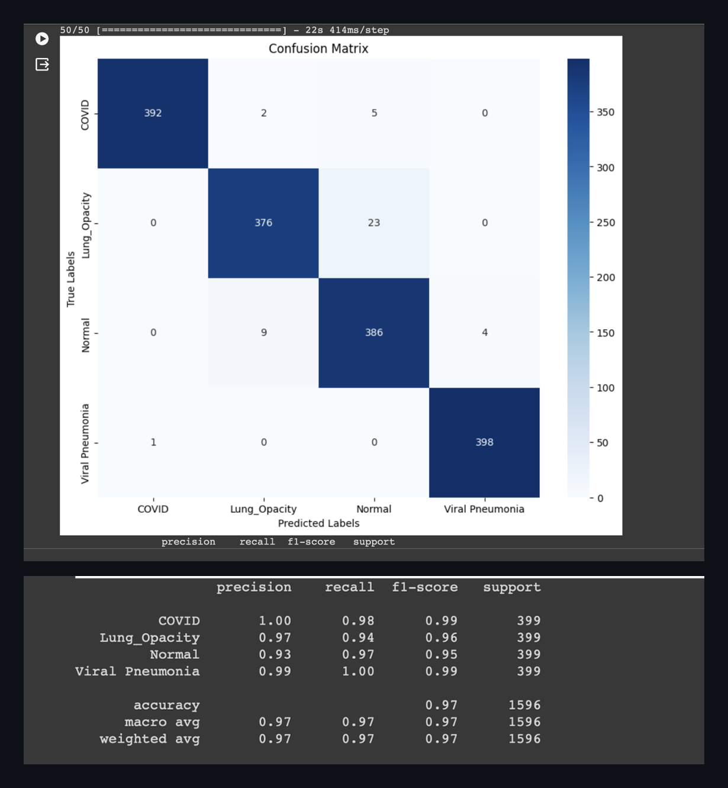
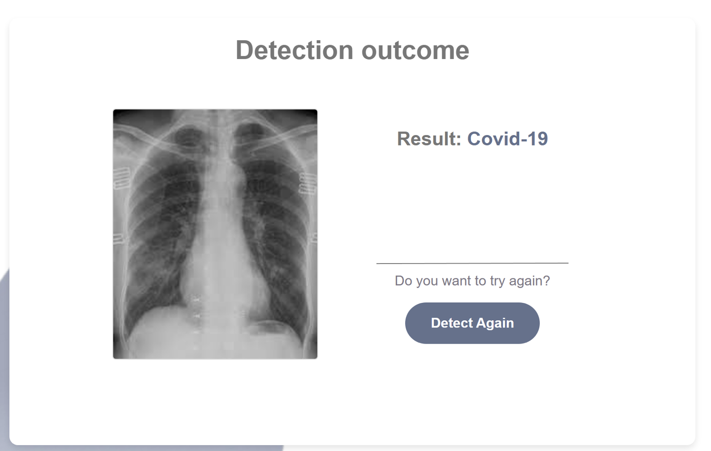

# XrayDiagnosis — 4-Class Chest X-ray Classification

A deep learning classifier that sorts chest X-ray images into four classes, built as a
graduation project at Princess Nourah Bint Abdulrahman University.

**97.2% test accuracy · 0.97 macro-F1** on a held-out set of 1,596 images.



## Results

| Metric | Value |
|---|---|
| Test accuracy | 97.2% |
| Macro-F1 | 0.97 |
| Training set | 18,016 images |
| Validation set | 1,588 images |
| Test set | 1,596 images |
| Classes | COVID · Lung Opacity · Normal · Viral Pneumonia |

Selected among the top posters at **She Codes 2024** and showcased at **TEDxPNU** —
see the [conference poster](poster.jpg).

## Where the model actually fails

Per-class results on the test set (399 images per class):

| Class | Precision | Recall | F1 |
|---|---|---|---|
| COVID | 1.00 | 0.98 | 0.99 |
| Lung Opacity | 0.97 | 0.94 | 0.96 |
| Normal | 0.93 | 0.97 | 0.95 |
| Viral Pneumonia | 0.99 | 1.00 | 0.99 |

The errors are not spread evenly. Almost all of them sit on a single boundary:
**23 Lung Opacity images were classified as Normal**, and 9 Normal images as Lung
Opacity. Every other off-diagonal cell is in the single digits or zero.

That asymmetry matters more than the headline accuracy. A Lung Opacity case read as
Normal is a false negative — an abnormal scan reported as clean — which is the failure
direction with real consequences in a screening context. Viral Pneumonia and COVID, by
contrast, are near-perfectly separated, with COVID precision at 1.00.

This is also where a single accuracy number would have hidden the problem: 97% looks
uniform until the confusion matrix shows one class carrying most of the error.

## Approach

**Model** — transfer learning with Xception (ImageNet weights) in TensorFlow/Keras,
fine-tuned on the X-ray dataset, with a baseline CNN for comparison.

**Data integrity before modeling.** Duplicate images across splits are the quiet way a
medical classifier reports accuracy it hasn't earned: the same image appearing in both
training and test turns memorization into a test score. Every file was hashed with MD5
and deduplicated before splitting, and the classes were balanced so accuracy couldn't
be inflated by a dominant class.

**Metrics chosen for the problem.** Accuracy alone hides weak classes in a multi-class
setting, so macro-F1 was tracked alongside it — it weights every class equally, meaning
one poorly-learned condition can't be masked by three strong ones. Confusion-matrix
error analysis guided each round of improvement rather than blind hyperparameter tuning.

**Explainability (Grad-CAM).** A high score doesn't establish that a model is reading
the anatomy. Grad-CAM heatmaps were generated to verify attention falls on lung fields
rather than on scanner artifacts, text overlays, or borders — a documented failure mode
in medical imaging, where models have achieved strong benchmark numbers by learning
which hospital's equipment produced the scan.

**A working interface.** The trained model is wrapped in an application that accepts
an uploaded image, validates its format, and returns a prediction or an explicit
"inconclusive" result rather than a silent failure.

**Input gating.** A softmax classifier returns a confident distribution over its four
classes for *any* input, including images that aren't X-rays at all. A separate gate
model runs first and rejects out-of-distribution inputs, so the system declines instead
of diagnosing a photograph.

## Known limitations

- **No external validation.** Performance is measured on a held-out split of the same
  dataset. Accuracy on images from different hospitals, scanners, or populations is
  unknown, and distribution shift is the usual reason medical models underperform in
  deployment.
- **Not deployed, and not a diagnostic tool.** This is a research and educational
  project; it is not validated for clinical use.
- **The gate model is a safeguard, not a guarantee** — it rejects clearly unrelated
  images, but was not adversarially tested.

## The application



The trained model is wrapped in a web interface: the user uploads an X-ray, the gate
model validates it, and the classifier returns the predicted class.

## Running it

```bash
pip install -r requirements.txt
```

Open the notebook and run the cells in order. The dataset is not included in this
repository. It is the COVID-19 Radiography Dataset, downloaded from Kaggle at the
start of the notebook. Set `KAGGLE_USERNAME` and `KAGGLE_KEY` as environment variables
before running — do not hardcode them.

## My role

Team graduation project. I led model training, evaluation, and documentation.

Team: Razan Alsunaidi, Hssah Alsherihi, Reema Alfaleh, Noura Alqasim
Supervisor: Dr. Hanan Adlan, Princess Nourah Bint Abdulrahman University

## Stack

Python · TensorFlow / Keras · Xception (transfer learning) · scikit-learn · NumPy ·
Matplotlib · Grad-CAM
